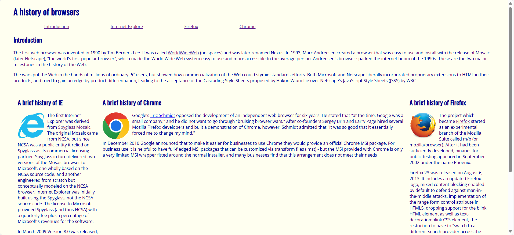
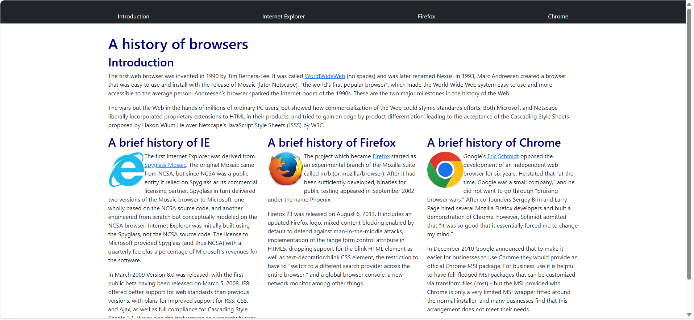

## Why Use UI Frameworks Like Bootstrap 5 Instead of Raw HTML and CSS?: 
After gaining experience with UI frameworks like Bootstrap, I realized the main difference between using pure CSS and Bootstrap lies in the number of steps required. Building a webpage can be compared to cooking a stew. If we think of HTML as the pot, then CSS is like preparing and chopping the ingredients yourself. Bootstrap, on the other hand, is like using pre-made, ready-to-cook ingredients. When building a webpage with raw HTML and CSS, you have to manually write all the <style> attributes. This involves coding the layout, spacing, typography, and responsiveness from scratch. In contrast, when building a webpage with Bootstrap, much of that work is already done for developers. We simply use pre-built components and classes to achieve professional results quickly.
In addition, UI frameworks like Bootstrap provide significant time-saving benefits for developers. Instead of writing complex CSS code for grids, margins, and responsive behavior, developers can utilize Bootstrap’s built-in classes and components. This results in a streamlined workflow, where creating a polished and consistent design takes fewer steps. Additionally, using a framework like Bootstrap ensures a clean and uniform look throughout a webpage with minimal effort, which is particularly helpful when working on large projects.

## Comparison of Web Pages Built With and Without a UI Framework:   
When I first began learning Bootstrap, I created two versions of a simple webpage: one using raw HTML and CSS, and the other using Bootstrap. The first webpage, built with only HTML and CSS, had basic typography and alignment. I had to manually set background, margins, and aligns.  

 
The second version, built using Bootstrap, looked much more polished and professional, even though it required far less code.  

 
By utilizing Bootstrap’s grid system and pre-designed components, I was able to create a well-structured and visually appealing webpage with minimal effort. This comparison highlights how much easier and more efficient it is to use a UI framework to achieve high-quality results.

## Software Engineering Benefits of UI Frameworks:
What are the pros and cons of using a UI framework? One of the most significant advantages is its cross-browser compatibility. Bootstrap has been rigorously tested across all major browsers, ensuring that websites built with it render consistently, no matter the platform. This eliminates the need for developers to write custom CSS rules to address browser-specific quirks, a common challenge when working with raw HTML and CSS. 
On the other hand, developers seeking to create highly unique and customized web pages may prefer to write their own CSS to have full control over the design. Additionally, while Bootstrap simplifies the process of building complex layouts compared to writing CSS from scratch, it still comes with a learning curve, especially for beginners unfamiliar with its class-based system.
I personally encountered this learning curve when rebuilding an existing web page. Although using pre-built components generally saves time, it can become tricky when something goes wrong, and I’m unsure how to fix it. Combining more complex components was particularly challenging for me, as understanding how they interact requires a deeper familiarity with the framework.

## Conclusion:
In conclusion, UI frameworks like Bootstrap 5 offer significant advantages in terms of time efficiency and design consistency. These benefits, coupled with the professional and polished results they deliver, make them an invaluable tool for developers, whether they are working on group projects or large-scale applications.

