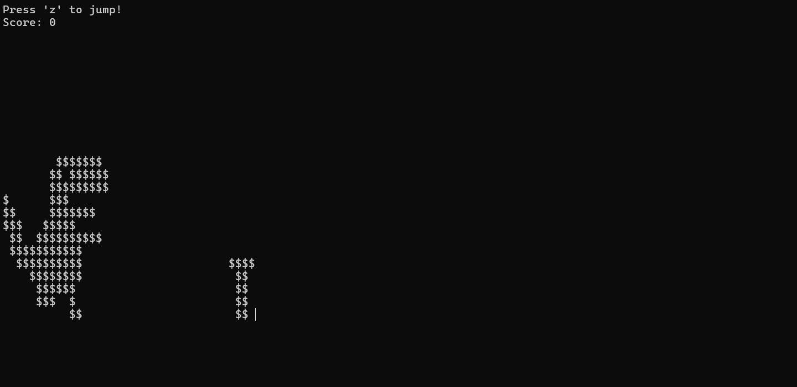

Dinosaur Run is a simple console-based game I developed using several functions and ASCII art to practice C language. 

I made this code in C language to improve understanding C language I have learned in ICS 212. I am interested in creating game and C language is a major language when people create a game. I wanted to learn and practice how a simple game can be made in C language. I got resource of making a simple run game from YouTube. 

<hr>

<pre>
This Dinosaur Run is inspired by the Google Chrome Dino game where the player controls a dinosaur that must jump over obstacles (represented as trees). Mechanics that the game has are described with the following codes :
  1. The dinosaur's position on the screen changes as it jumps and falls back due to gravity.
  2. The player presses the 'z' key to make the dinosaur jump.
    1 and 2 mechanics are executed by code below:
    ```ruby
    // this Y-coordinate is a constant value for dino position where the dino lands (ground level)
    #define DINO_BOTTOM_Y 12
    ...
    int main() {
      boolean isJumping = 0; // Flag indicating if the dino is jumping
      boolean isBottom = 1; // Flag indicating if the dino is on the ground
      const int gravity = 3; // Gravity value to control jump or false speed
      ...
      // Main game loop
      while (1)
      {
        // Check if the 'z' key is pressed and if the dino is on the ground
        if (GetKeyDown() == 'z' && isBottom)
        {
            isJumping = 1;   // Set jumping flag
            isBottom = 0;    // Dino is no longer on the ground
        }

        // Dino jump/fall mechanics
        if (isJumping)
        {
            dinoY -= gravity;  // Move dino up while jumping
        }
        else
        {
            dinoY += gravity;  // Move dino down while falling
        }

        // Ensure the dino doesn't fall below the ground level
        if (dinoY >= DINO_BOTTOM_Y)
        {
            dinoY = DINO_BOTTOM_Y;  // Keep dino on the ground
            isBottom = 1;           // Set ground flag
        }

        // Stop the jump when the dino reaches the peak of the jump
        if (dinoY <= 3)
        {
            isJumping = 0;  // Stop jumping (dino will start falling)
        }
    }
    ```
  3. Trees (obstacles) move from the right side of the screen to the left.
    ```ruby
    #define TREE_BOTTOM_Y 20
    ...
    int treeX = TREE_BOTTOM_X;
    ...
    // In the Main game loop
    // Move the tree to the left
        treeX -= 2;
        if (treeX <= 0) 
        {
            // Reset tree position after it goes off-screen
            treeX = TREE_BOTTOM_X; 
            score++;             
        }
    ```
  4. If the dinosaur collides with a tree, the game ends and displays a "Game Over" message along with the final score.
    ```ruby
     // Collision detection: if tree is close and dino is not high enough, game over
        if (treeX <= 2 && dinoY >= DINO_BOTTOM_Y - 2)
        {
            printf("\nGame Over! \nFinal score: %d\n", score);  // Display final score
            break;  // Exit the game loop
        }
    ```
  5. As the score increases, the game's speed increases, making it progressively faster. 
    ```ruby
    // Increase game speed (decrease delay) every 10 points, making the game harder
        if (score % 10 == 0 && gameSpeed > 20) {
            gameSpeed -= 2;
        }
    ```
</pre>

<hr>

Source: 
