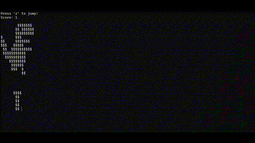

## Project Desciption 

This project is a console-based game inspired by the Google Dinosaur game, developed in C. Players control a dinosaur that jumps to avoid oncoming trees. The game tracks the score and increases speed as the player progresses. I made this code in C language to improve understanding C language when I was learnig C in ICS 212. I am interested in creating game and C language is a major language when people create a game. I wanted to learn and practice how a simple game can be made in C language. I got resource of making a simple run game from YouTube. 

<hr>

## Features

* Reak-time user inpue using the keyboard
* ASCII art representation of the dinosaur and trees
* Increasing difficulty with faster game speed
* Score tracking and game over message.

<hr>

## Code Highlights

Some mechanics that the game has are described with the following codes:
**_1. Jumping Mechanism_**

  The code implements a simple but effective jump mechanic for the dinosaur using the **GetKeyDown()** function and the **isJumping** flag. When the player presses the 'z' key, the dinosaur jumps and gravity pulls it back down.
  This part of the code moves the dinosaur up (**dinoY -= gravity**) when the player jumps. When it reaches the top (defined by **dinoY <= 3**), it falls back down with gravity until it lands at the bottom (**dinoY >= DINO_BOTTOM_Y**).
  
```ruby
  if (GetKeyDown() == 'z' && isBottom)
{
    isJumping = 1;
    isBottom = 0;
}
  
if (isJumping)
{
    dinoY -= gravity;
}
else
{
    dinoY += gravity;
}

if (dinoY >= DINO_BOTTOM_Y)
{
    dinoY = DINO_BOTTOM_Y;
    isBottom = 1;
}

if (dinoY <= 3)
{
    isJumping = 0;
}
```

**_2. Collision Detection_**

  The code handles a simple collision detection mechanism to determine if the dinosaur hits the tree. If the tree's **x**-position is within a certain range and the dinosaur is on the ground, the game ends.
  The tree is represented by the treeX variable, and the game checks if the tree's position is near the dinosaur (**treeX <= 2**) and if the dinosaur is at or near the ground (**dinoY >= DINO_BOTTOM_Y - 2**). This simple condition triggers the "Game Over" screen.
  
```ruby
if (treeX <= 2 && dinoY >= DINO_BOTTOM_Y - 2)
{
    printf("\nGame Over! \nFinal score: %d\n", score);
    break;
}
```

**_3. Dynamic Game Speed_**

  The game increases in difficulty as the player's score rises. The game speed decreases by 2 milliseconds each time the score is divisible by 10, making the game faster as the player progresses.

```ruby
if (score % 10 == 0 && gameSpeed > 20) {
    gameSpeed -= 2;
}
```

<hr>

## Challenges and what I learn

One of the challenges was implementing jump mechanics with limited console graphics. Through this project, I learned more about controlling character movement and game loops in a simple C-based game.

Source: 
