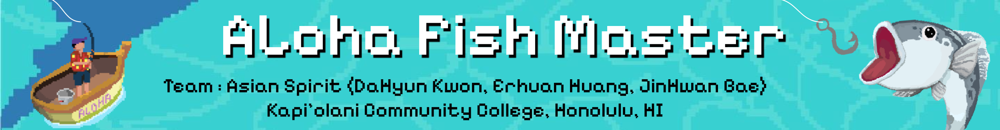
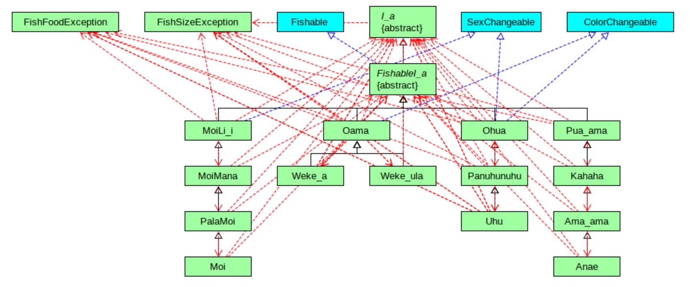
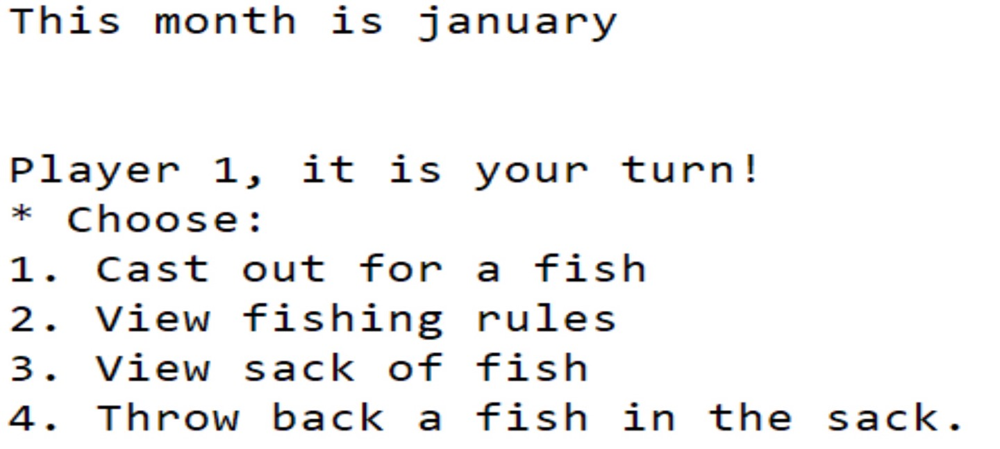
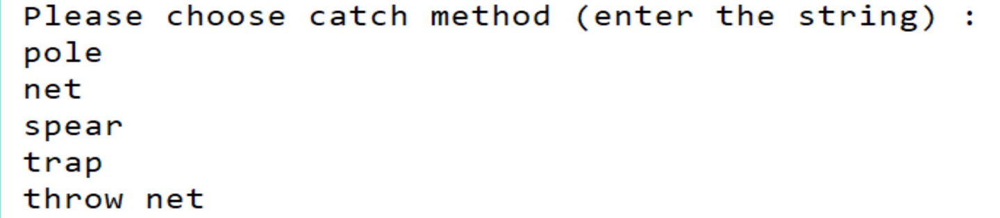
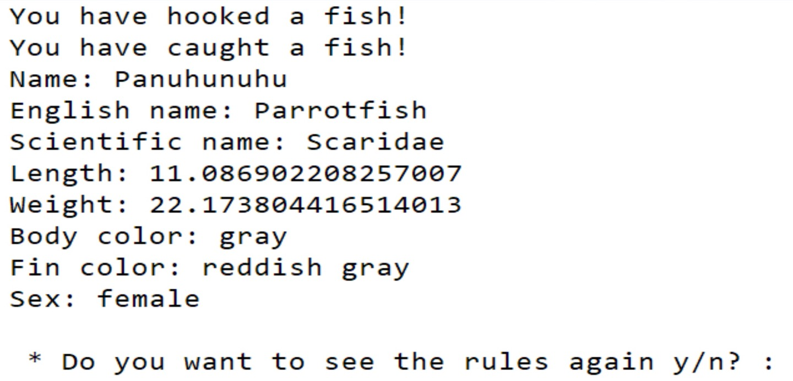
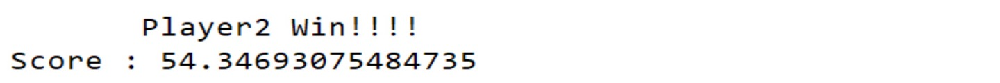

## Project Summary

This **_Aloha Fish Master_** project was a group assignment I completed during the ICS 211 course at Kapiolani Community College in Fall 2023. Each team member was responsible for developing an Object-Oriented Class hierarchy representing Hawaiian fish families. We were given the **_I'a_** abstract superclass and tasked with implementing three specific fish families: **_'Ama'ama Family, Weke Family, and Uhu Family_**. The project culminated in a two-player, text-based fishing tournament game that utilized the **_I'a_* object classes. My role focused on implementing the **_Uhu Family_**, which included the **_Ohua Class, Panuhunuhu Class, and Uhu Class_**. Additionally, I designed the project poster. 

## Brief Information of the Project

Aloha Fish Master is a Text-based Game for two players. The game is held for 12 months. Each player has 3 chances of catching fish in each month and they can use one of 5 methods: 'net', 'pole', 'spear', 'thow net', 'trap'.

To give you a flavor of the game, here is an excerpt from one run:

## Code Information: 
  
  

  The picture above is a hierarchy of the Game. Describe the code briefly, 
  * I_a is an abstract superclass for fall fish species. This is the backbone of all nethods which share with its subclass: Anae, Moi, Uhu, and Weke_a/Weke_ula.
  * Fishable is Interface for I_a fish hierarchy.
  * Anae, Moi, Uhu, Weke_a/ Weke_ula are subclasses creating each fish data.
  * FishDriver is the driver class for the game. To prevent poor readability, Inpur codes and output codes are created as independent classes then instantiated in FishDriver class. 

## Visual of Game:

  When one player starts the game, they would see menu like below:

  

  Then The player can choose a method to catch fish.

  

  Information of fish they caught is shown on the screen and they will be asked to see rules about fishing. Some fish has legal minimum size that players allow to catch. If a player put into illegal size of fish into their sack, all of fish they have catched would be confiscated. Players always see the legality on the menu.

  

  Once 12 months of turns are taken, the player whose sum of the 3 largest fish' lengths is greater will be the winner of the game.

  

## What I learn from this project:
Through the development of the **_Aloha Fish Master_** game, I gained deeper understanding of Object-Oriented Programming (OOP) principles, such as class hierarchies, encapsulation, and polymorphism. I worked with abstract classes, like the I’a superclass, and learned how to implement inheritance effectively by creating specific fish families. Additionally, I practiced composing a clean class structure, enhancing my skills in designing and managing complex relationships between objects. Building a text-based game introduced me to core game development concepts, such as managing turn-based logic, handling user inputs, and tracking the game state for two players. This project also strengthened my problem-solving abilities, as I had to debug various game mechanics and design an intuitive player experience.
