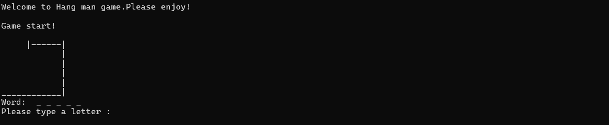
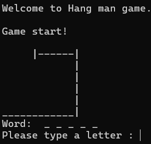
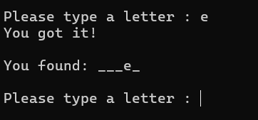
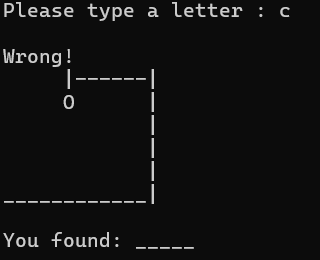
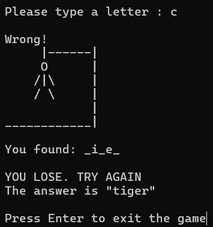
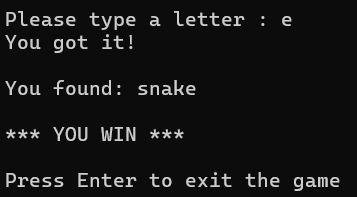

This is a Hangman Game, a simple word-guessing game where the player tries to guess a hidden word letter by letter. The player has a limited number of incorrect guesses before losing the game. This game is created with array, loop operations, and if statements. 

This game was created to practice making an array, loop operations and if statements. 

When the player starts the game, a random word is chosen from a predefined list of array called 'words' using rand().

The player can see the word, with each letter hidden as an underscore.

The player guesses letters, and if the letter that the player entered exists in the word, it is revealed in the correct position. 

If the player guesses wrong, the visual representation of a stick figure on a gallows (the "hangman") progress.

The game ends when the player either guesses the word correctly or reaches 6 wrong guesses. 

</pre>

Source:
