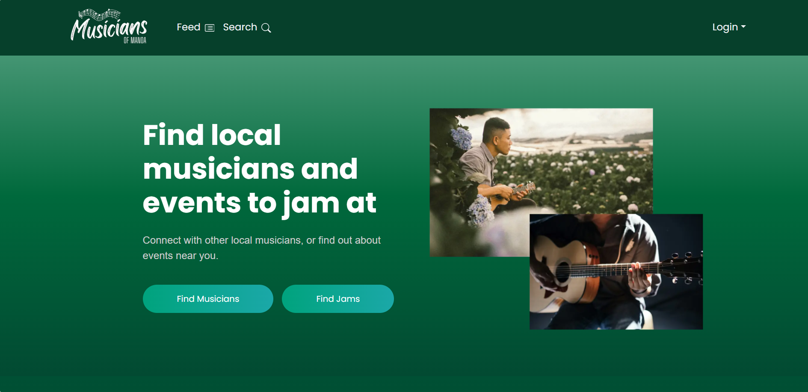

# Musicians of Manoa

**A web application connecting musicians at UH Manoa to discover jam sessions, network, and collaborate.**

## Project Overview
Musicians of Manoa is a web application developed as part of a team project in the ICS 314: Software Engineering course at the University of Hawaii at Manoa. The application aims to create a platform where UH Manoa musicians can easily connect, discover jam sessions, and collaborate with one another.

This project enhanced my skills in full-stack web development, teamwork, and building user-focused applications.

## Contributions
I was responsible for developing the **Sign-Up page**, **Users' Profile page**, and the **User Profile view for logged-in users**. My focus was on building intuitive and responsive user interfaces using React and TypeScript to deliver a seamless user experience.

For the **Sign-Up page**, I implemented form validation and designed a user-friendly layout to efficiently collect user data. The **Users' Profile page** enables users to view other users' personal profiles, while the **User Profile view for logged-in users** dynamically displays personalized content tailored to the logged-in user.

## What I learned
Through this project, I enhanced my skills in frontend development, state management using `useState`, and creating user-friendly interfaces with React and TypeScript.

## Technologies Used
- **Frontend:** Next.js, TypeScript, React
- **Deployment:** Vercel

## Features
- Discover upcoming jam sessions at UH Manoa.
- Connect and collaborate with other musicians on campus.
- Responsive design for seamless user experience across devices.

## Links
- [**Homepage**](https://musicians-of-manoa.github.io/)
- [**Live Application**](https://musicians-of-manoa.vercel.app/)
- [**Source Code**](https://github.com/musicians-of-manoa/musicians-of-manoa)

